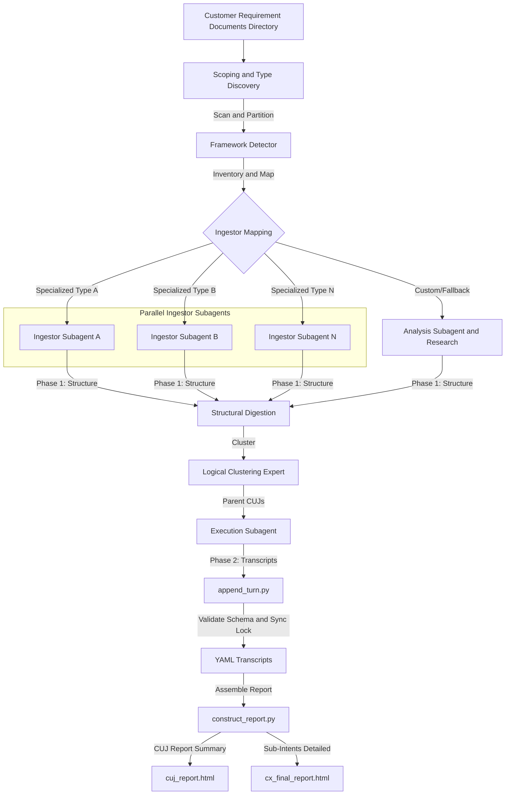
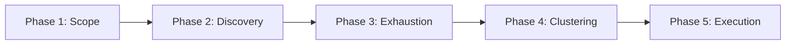

# Critical User Journey (CUJ) Transcript & Report Generator (`cxas-cuj-report-generator`)

An automated pipeline that autonomously ingests massive, fragmented customer
requirement documents (such as diagrams, BRDs, code etc.) and generates highly
accurate, interactive dialogue journey reports with high-fidelity conversational
transcripts for every discovered sub-intent.

--------------------------------------------------------------------------------

## ⏱️ Real-World Value & Scale

This pipeline is engineered to handle massive enterprise-scale datasets
containing thousands of customer requirement documents such as diagrams, BRDs,
code etc. It automates the discovery and mapping of unique sub-intents,
clustering them into logical Critical User Journeys (CUJs), and compiling them
into natural dialogue transcripts. This transforms requirements analysis from a
multi-week manual effort into a highly accelerated automated execution.

--------------------------------------------------------------------------------
--------------------------------------------------------------------------------

## 🏗️ System Architecture & Core Components

The engine operates as an orchestrator that partitions tasks, enforces strict
protocols, and compiles files.



### 1. Core Scripts

#### `append_turn.py`

A thread-safe incremental transcript builder. It validates dialogue turns
against the YAML schema contract (`resources/schemas/transcript_schema.yml`)
before appending them, using file locking to support safe, concurrent writes.

**Usage**:

```bash
python3 append_turn.py \
  --transcript_file="path/to/output/transcript.yaml" \
  --input_file="path/to/turn_input.yaml"
```

#### `construct_report.py`

The HTML compiler engine. It reads a directory of completed YAML transcripts,
groups them by `parent_cuj`, and generates a single-file, fully self-contained
HTML report with nested stylesheets and an embedded interactive JS engine.

*   **Key Flags**:

    *   `--cuj_report` (boolean): If `True`, generates `cuj_report.html`
        containing at most **3 representative examples** per CUJ (focused on
        high-level status). If `False`, generates `cx_final_report.html`
        containing **all examples** (fully expanded detailed list).
    *   `--transcripts_dir` (string, required): Directory containing YAML
        transcripts.
    *   `--output_file` (string, required): Target path for the assembled HTML
        report.
    *   `--report_heading` / `--project_name` / `--title`: Custom text to
        hydrate the report header and document shell.


**Usage (Summary CUJ Report)**:

```bash
python3 construct_report.py \
  --transcripts_dir="output/transcripts" \
  --output_file="output/cuj_report.html" \
  --cuj_report=True \
  --report_heading="Critical User Journey Summary" \
  --project_name="Enterprise CX Overhaul" \
  --title="Critical User Journey Report" \
  --intro_context="High-level visual summary of top CUJ scenarios." \
  --intro_goal="Verify primary flows." \
  --index_title="Critical User Journeys Index"
```

**Usage (Detailed Report)**:

```bash
python3 construct_report.py \
  --transcripts_dir="output/transcripts" \
  --output_file="output/cx_final_report.html" \
  --cuj_report=False \
  --report_heading="Comprehensive Sub-Intents Dialogue Mapping" \
  --project_name="Enterprise CX Overhaul" \
  --title="Detailed Critical User Journey Report" \
  --intro_context="Complete dialogue journey report for discovered sub-intents." \
  --intro_goal="Analyze granular dialogue steps." \
  --index_title="Comprehensive Intents Directory"
```

### 2. Specialized Sub-Agents (`agents/`)

*   **Framework Detector** (`framework_detector.md`): Scans massive file trees,
    inventories file extensions, identifies configuration formats, and
    recommends specialized Ingestor Skills.
*   **Expert Ingestor** (`expert_ingestor.md`): Utilizes specialized format
    skills to extract granular interaction logic, dialogue paths, and intents.
*   **Logical Clustering Expert** (`logical_clustering_expert.md`): Consolidates
    the raw sub-intent inventory, merging them logically into a compact set of
    Parent CUJs to avoid category explosion.
*   **Execution Subagent** (`execution_subagent.md`): Executes Phase 2 of
    ingestion. Runs parallel LLM generation to produce full natural dialogue and
    appends turns using `append_turn.py`.

### 3. Ingestion Protocols (`protocols/`)

The orchestrator and execution subagents strictly follow standardized, modular
ingestion protocols to ensure coverage and robustness:

*   **Two-Phase Ingestion Protocol**
    (`protocols/cxas-protocol-two-phase-ingestion/`): Decouples parsing
    (structural digestion) from dialogue generation.
*   **Task Coverage Checklist Protocol** (`protocols/task-coverage-protocol/`):
    Tracks checklist progress using `manage_checklist.py` and
    `task_checklist.json` to prevent coverage gaps.

### 4. UI & Resource Components (`resources/`)

The compiled HTML files leverage modular CSS, Javascript, and HTML template
components located under `resources/components/`.

These components compile into a fully self-contained, offline-capable, and
interactive Critical User Journey (CUJ) report. It supports rich search/filter
controls, collapsible sections, inline modal notes, and detailed JSON payload
inspectors for webhook and tool calls.

--------------------------------------------------------------------------------

## 🚀 End-to-End Execution Flow

The orchestrator executes the pipeline in 5 sequential phases:



1.  **Scoping & Type Discovery**: The orchestrator scans the folder, inventories
    extensions, and determines which specialized ingestors to run.
    Framework-specific ingestors take precedence over generic extension ones.
2.  **Discovery**: Specialized ingestors run Phase 1 structural digestion.

    *   *Fallback Rule*: If an unknown file type is found, an **Analysis
        Subagent** is spawned to read a sample, search documentation, report a
        parsing strategy, and automatically attempt to codify a new ingestor
        skill.

3.  **Exhaustion**: Loops until no new intents or skipped files are discovered.

4.  **Clustering**: The `Logical Clustering Expert` groups raw intents. To
    reduce noise and context window bloat, raw transcript details are stripped,
    passing only a clean YAML list of `id`, `name`, and `intent`.

5.  **Execution**: The `Execution Subagent` processes transcripts in parallel.

    *   *Immediate ID Verification Rule*: Always assume customer-provided
        identifiers (Account numbers, SSN, Order IDs) trigger a backend check;
        immediately insert a `tool_call` or `webhook_call` after the turn.
    *   *Dynamic Bisecting (Watchdog)*: A watchdog timer checks for stuck tasks.
        If a subagent batch fails verification twice, the orchestrator bisects
        the batch and spawns two parallel subagents to complete the workload
        safely.


--------------------------------------------------------------------------------

## 🧪 Evaluation & Testing

The logic is verified using e2e and granular assertion frameworks located under
`evals/`.

### 1. E2E Evaluation (`evals/EVAL_e2e.yaml`)

Tests the entire pipeline using a mock directory (`resources/test_inputs/`)
containing various customer requirement documents such as diagrams, BRDs, code
etc.

*   **`simple_e2e_flow`**: Verifies that the agent can successfully scan inputs,
    discover sub-intents, group them into CUJs, generate valid restaurant-domain
    YAML transcripts, and compile the HTML report.
*   **`e2e_flow_unspecified_counts`**: Verifies the agent's capacity to
    autonomously discover taxonomy and cluster counts without explicit hints.

### 2. Granular Evaluation (`evals/EVAL_granular.yaml`)

Asserts specific guardrails and execution requirements, verifying that the
agent:

*   Strictly initializes and maintains `task_checklist.json`.
*   Applies the framework precedence rule.
*   Trims leading agent greetings for `user_first_transcript` compliance.
*   Generates both summary and detailed reports (`dual_reports`).
*   Invokes `append_turn.py` for all turn writes.
*   Invokes bisection logic on failures.

--------------------------------------------------------------------------------

## 🛠️ Developer & Extensibility Guide

This system is built to be fully modular. Developers can easily add support for
new input formats and custom UI templates.

### Adding a New Ingestor

#### 1. Framework Ingestor

Create a new skill under `ingestors/frameworks/<framework_name>/SKILL.md`.

*   Define how to recognize the framework's presence (e.g., parsing
    `package.json` or unique config files).
*   Document the structural extraction instructions (Phase 1 digestion).

#### 2. Generic File Extension Ingestor

Create a new skill under `ingestors/files/<extension>/SKILL.md`.

*   Instruct agents how to parse the file format and extract dialogue fields.

### Customizing UI Templates

1.  To modify stylesheets, edit CSS files located in `resources/components/`
    (e.g., `resources/components/cuj_card/cuj_card.css`).
2.  To add interactive features (e.g., adding export buttons), edit
    `resources/components/base/interaction_engine.js`.
3.  Run `construct_report.py` to compile your changes into a new HTML report.
