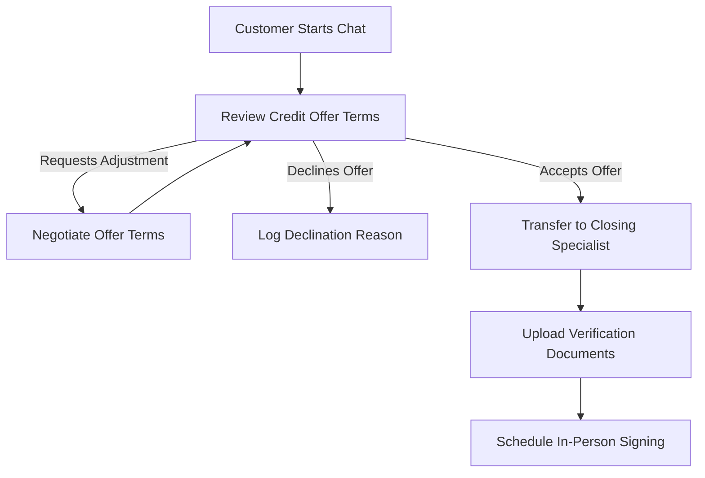

# Bank Credit Offer Advisor & Closing Assistant

Welcome to the **Bank Credit Offer Advisor**, a state-of-the-art conversational AI agent built on the Google Customer Engagement Suite (GECX) platform. This advisor empowers bank customers to explore, negotiate, accept, or decline pre-approved credit offers in a seamless chat experience.

> [!NOTE]
> **Practice Agent**: This repository serves as a practice implementation for agent creation and evaluation workflows using **CXAS-scrapi**.

---

## 🌟 Key Customer Journeys

### 1. Transparent Offer Review
Retrieve and review active credit offer details with complete transparency:
- **Loan Amount** (e.g., $10,000.00)
- **Interest Rate** (e.g., 12.5% APR)
- **Repayment Term** (e.g., 36 months)
- **Estimated Monthly Payment**

### 2. Real-Time Terms Negotiation
Partner with our AI advisor to request terms adjustments:
- Request a lower interest rate or a higher loan limit.
- Receive immediate eligibility evaluations against bank underwriting thresholds.

### 3. Seamless Acceptance & Closing Flow
Upon accepting an offer, the customer is seamlessly routed to the **Closing Specialist** (`closing_agent`):
- **Document Collection**: Securely submit identification and verification documents.
- **In-Person Appointment Scheduling**: Select a preferred date and time to sign final closing documents at your local bank branch.

### 4. Declination Logging
If the offer doesn't meet the customer's needs:
- Easily record declination decisions.
- Capture primary feedback (e.g., "interest rate too high" or "loan term too short") to help improve future offers.

---

## 🌐 Multilingual Support

The advisor speaks your preferred language via explicit language switching. Simply ask the advisor at any point:
- **English**: *"Speak in English"*
- **Spanish**: *"Hable en español"*
- **Portuguese**: *"Fale em português"*

---

## 🏗️ Technical Architecture

This application utilizes a robust multi-agent topology:

- **`credit_advisor_agent` (Root Advisor)**: Orchestrates initial greeting, offer retrieval, negotiation logic, and decision milestones.
- **`closing_agent` (Closing Sub-Agent)**: Handles closing requirements (document upload validation and in-person signature appointment booking).
- **Core Tools**:
  - `get_credit_offer`: Retrieves active credit offer terms.
  - `evaluate_negotiation`: Validates terms adjustment eligibility.
  - `accept_credit_offer`: Confirms offer acceptance.
  - `log_declination_reason`: Records offer rejection reasons.
  - `set_session_state`: Tracks conversation progression.
  - `upload_document`: Accepts verification documents.
  - `schedule_signature`: Books final signing appointments at bank offices.
